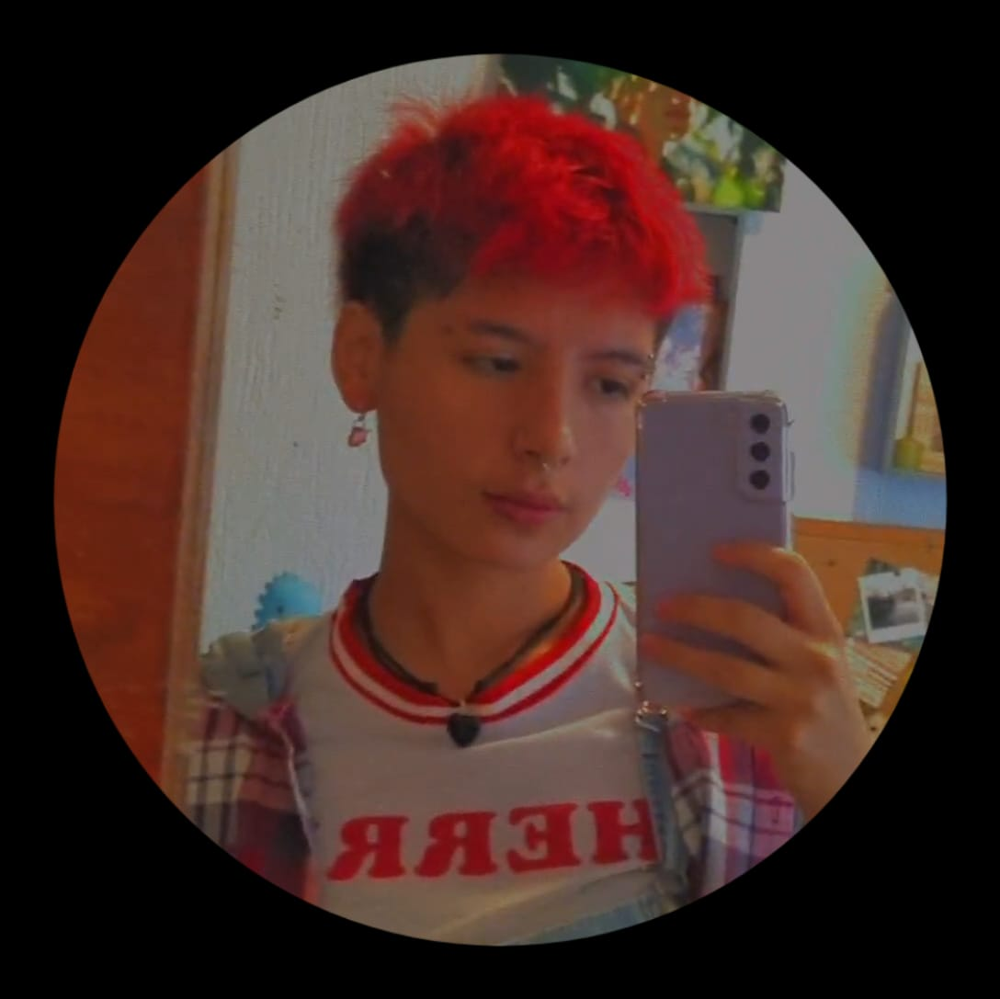

# Práctica 1

**Nombre**: Diana Ramos Garcia

**Edad**: 21 años

## Presentación 
Hola me llamo Diana pero igual me conocen como Dino, tengo 21 años y vivo en la cdmx. 
Soy programadxr y estudiante de videojuegos y actualmente estoy trabajando 
en un pequeño estudio mexicano de Mérida, Yucatán.

Mi pasión por los videojuegos emepezó a muy temprana edad ya que tuve el acceso 
a estos desde mis 5 años. Desde mis 12 años de edad sabía que esto
era a lo que me quería dedicar ya que admiraba el trabajo técnico detrás de ellos. 

Al terminar mis estudios espero seguir con mi trabajo de programador de videojuegos,
sin embargo me encantaría abrir mi propio estudio de juegos.

### Pasatiempos
Además de **jugar videojuegos** como pasatiempo principal, también disfruto las siguientes actividades:

- Tocar la guitarra 
- Fotografía
- Crear contenido para redes sociales
- Skate

Estas actividades las realizo para mantener mi cabeza despejada y creativa,
ya que el programar tanto crea una cierta forma cuadrada al pensar.
Y en el desarrollo de videojuegos mantener la creatividad  y flexibilidad es muy importante.

## Mis Redes Sociales

 - [Instagram: @dinorekkos](https://www.instagram.com/dinorekkos/?hl=es)
 - [Itchio: DinoRekkosGD](https://dinorekkosgd.itch.io/)s
 - [Tiktok: @Dinorekkos](https://www.tiktok.com/@dinorekkos)

